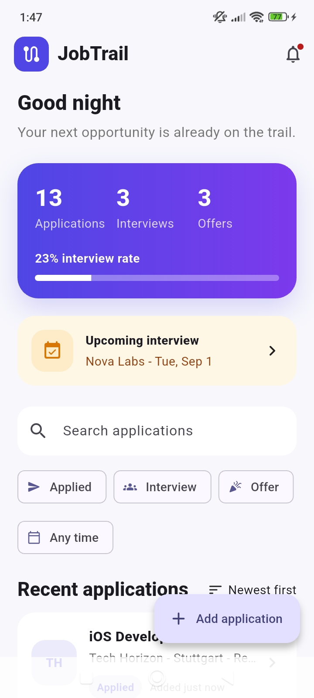
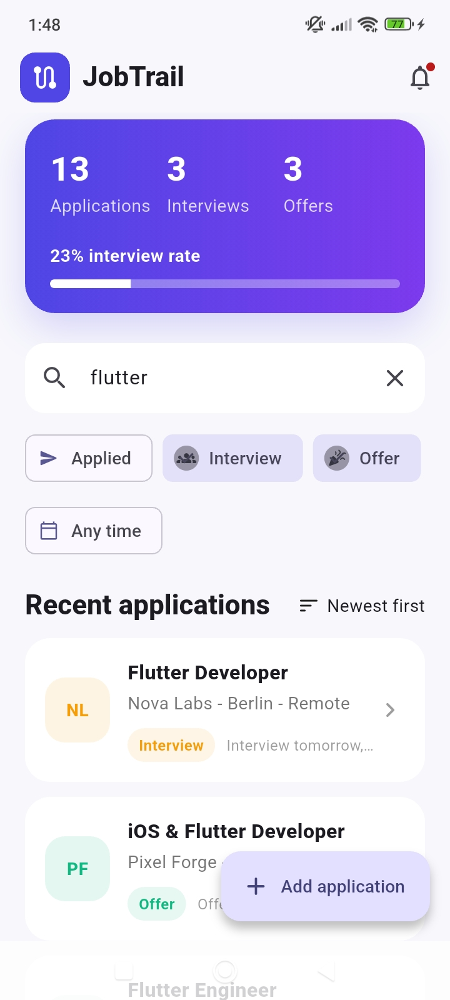
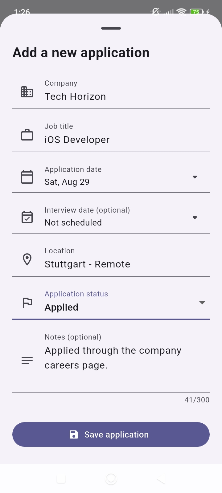
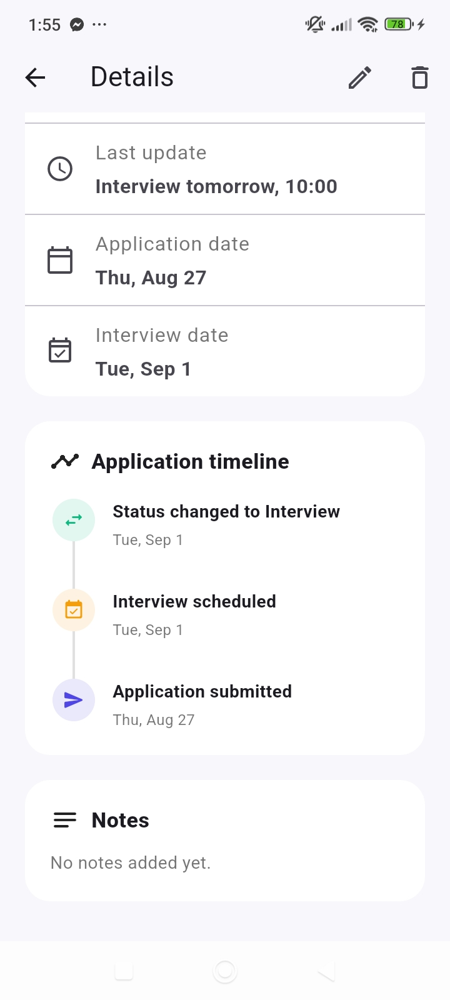

# JobTrail

[](https://github.com/aliyoussefhamo/jobtrail/actions/workflows/flutter_ci.yml)

JobTrail is a cross-platform Flutter application for organizing and tracking job applications throughout the hiring process.

The project is being developed as a production-minded portfolio application, with a focus on clean architecture, maintainable code, responsive UI, and automated testing.

## Screenshots

<table>
  <tr>
    <th>Dashboard</th>
    <th>Search & filters</th>
    <th>Add application</th>
  </tr>
  <tr>
    <td></td>
    <td></td>
    <td></td>
  </tr>
  <tr>
    <th colspan="2">Application details & timeline</th>
    <th>Splash screen</th>
  </tr>
  <tr>
    <td colspan="2" align="center"></td>
    <td></td>
  </tr>
</table>

## Features

- View a dashboard with application, interview, and offer statistics
- Filter applications by one or more statuses
- Filter applications by application date
- Search applications by company, role, location, or status
- Sort applications by newest, company, or status
- Track application and optional interview dates
- Schedule local reminders for upcoming interviews
- Use custom cross-platform launcher icons and a branded native splash screen
- Review application activity in a visual timeline
- Add applications with company, role, location, status, and optional notes
- View complete application details
- Edit existing applications using a reusable form
- Delete applications with a confirmation dialog
- Persist application data locally with SQLite
- Generate company initials automatically
- Validate required form fields
- Update dashboard data and statistics reactively

## Application Statuses

- Applied
- Interview
- Offer
- Rejected

## Architecture

JobTrail uses a feature-first structure with a lightweight MVVM and Repository approach:

```text
lib/
├── app/
│   └── jobtrail_app.dart
├── core/
│   └── app_theme.dart
└── features/
    └── applications/
        ├── data/
        │   ├── application_database.dart
        │   ├── application_event_mapper.dart
        │   ├── application_repository.dart
        │   └── job_application_mapper.dart
        ├── domain/
        │   ├── application_event.dart
        │   └── job_application.dart
        └── presentation/
            ├── application_details_page.dart
            ├── application_form_sheet.dart
            ├── application_timeline.dart
            ├── applications_view_model.dart
            ├── dashboard_page.dart
            └── upcoming_interview_card.dart
```

- **Domain** contains the core application model and status definitions.
- **Data** owns SQLite access, mapping, migrations, and repository implementations.
- **Presentation** contains screens, reusable widgets, navigation, and UI state.
- **ViewModel** coordinates UI actions and notifies widgets when application data changes.
- **Repository** keeps persistence details out of the presentation layer and allows test doubles to be injected.

## Technical Highlights

- Flutter and Dart
- Material 3 interface
- `ChangeNotifier` and `ListenableBuilder` for state updates
- Reusable add/edit application form
- Repository abstraction for separating data access from UI logic
- SQLite persistence with asynchronous CRUD operations
- Database migrations and application activity events
- Local interview reminders with notification permission handling
- Dependency injection for production and test repositories
- Loading, empty, success, and error states with retry actions
- Time-aware dashboard greeting and responsive safe-area handling
- Widget tests covering the main user flows
- SQLite integration tests covering CRUD, cascading deletes, and migrations
- 86% automated test coverage across application code
- GitHub Actions CI for formatting, static analysis, and automated tests

## Tests

The project currently includes 36 automated tests covering:

- Dashboard, search, sorting, and combined filters
- Empty, loading, retry, success, and failure states
- Add, edit, details, and delete user flows
- Time-aware greetings and upcoming interviews
- Notification scheduling and cancellation
- Domain-to-database mapping
- SQLite CRUD, migrations, events, and cascading deletes

Run the checks with:

```bash
dart format --output=none --set-exit-if-changed lib test
flutter analyze
flutter test
```

The same checks run automatically on every push to `main` and every pull request through GitHub Actions.

## Android Release

Download the latest signed Android APK from the [GitHub Releases](https://github.com/aliyoussefhamo/jobtrail/releases/latest) page.

The Android application ID is `com.aliyoussefhamo.jobtrail`. Release builds are signed with a private upload key that is stored outside the repository.

## Getting Started

### Requirements

- Flutter SDK
- Dart SDK
- Android Studio or Visual Studio Code
- Android device, Android emulator, or another Flutter-supported target

### Installation

```bash
git clone https://github.com/aliyoussefhamo/jobtrail.git
cd jobtrail
flutter pub get
flutter run
```

## Roadmap

- [x] Application dashboard
- [x] Status filtering
- [x] Create, view, update, and delete applications
- [x] Optional application notes
- [x] Widget tests for core user flows
- [x] Local persistence with SQLite
- [x] Application search
- [x] Application sorting
- [x] Application and interview dates
- [x] Application activity timeline
- [x] Advanced filtering
- [x] Interview reminders and notifications
- [x] Improved test coverage
- [x] App branding and release assets
- [x] Empty, loading, and error states
- [x] Automated GitHub Actions CI
- [x] Android release APK

## Current Project Status

JobTrail is feature-complete for its first portfolio release. Application data is stored locally with SQLite and remains available across app restarts. Multi-status and application-date filters can be combined with search, while local notifications remind users about upcoming interviews. Automated quality checks and a signed Android release complete the first production-minded portfolio milestone.

## Author

**Ali Hamo** — Software Engineer | Flutter & iOS Developer

- [LinkedIn](https://www.linkedin.com/in/ali-hamo-5a814a21b/)
- [GitHub](https://github.com/aliyoussefhamo)
